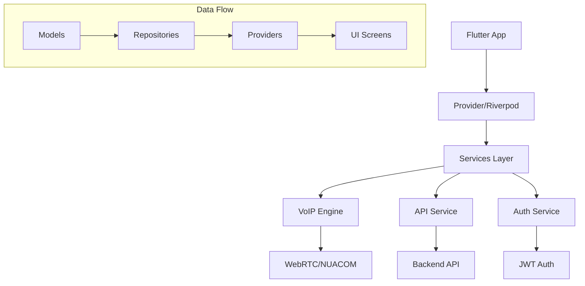

# DispatcheurCC Flutter

Sistema de dispatch multi-plataforma para gestão de chamadas VoIP, missões e relatórios desenvolvido em Flutter.

## 🚀 Características

- **Multiplataforma**: Funciona em Mobile (iOS/Android), Desktop (Windows/macOS/Linux) e Web
- **VoIP Completo**: Sistema WebRTC integrado com NUACOM para chamadas de voz
- **Gestão Multi-usuário**: Suporte para Administradores, Agentes e Clientes
- **Dashboard em Tempo Real**: Monitorização de chamadas, missões e relatórios
- **Sistema de Notificações**: Email e notificações push integradas

## 📊 Arquitetura do Sistema



## 🏗️ Estrutura do Projeto

```
lib/
├── main.dart                   # Ponto de entrada da aplicação
├── app.dart                    # Configuração da aplicação
├── constants/                  # Constantes e configurações
│   ├── app_constants.dart
│   ├── api_constants.dart
│   └── voip_constants.dart
├── models/                     # Modelos de dados
│   ├── user_model.dart
│   ├── call_model.dart
│   ├── mission_model.dart
│   └── contact_model.dart
├── services/                   # Camada de serviços
│   ├── voip_engine.dart       # Motor VoIP WebRTC
│   ├── api_service.dart       # Cliente HTTP
│   ├── auth_service.dart      # Autenticação
│   └── notification_service.dart
├── providers/                  # Gestão de estado
│   ├── auth_provider.dart
│   ├── call_provider.dart
│   ├── mission_provider.dart
│   └── settings_provider.dart
├── screens/                    # Ecrãs da aplicação
│   ├── login/
│   │   └── login_screen.dart
│   ├── dashboard/
│   │   ├── admin_dashboard.dart
│   │   ├── agent_dashboard.dart
│   │   └── client_dashboard.dart
│   ├── voip/
│   │   ├── voip_screen.dart
│   │   ├── incoming_call_screen.dart
│   │   └── components/
│   ├── missions/
│   └── reports/
├── widgets/                    # Widgets reutilizáveis
│   ├── common/
│   ├── call_components/
│   └── dashboard_components/
└── utils/                      # Utilitários
    ├── navigation.dart
    ├── permissions.dart
    └── helpers.dart
```

## 🔧 Configuração e Instalação

### Pré-requisitos

- Flutter SDK 3.16.0+
- Dart 3.2.0+
- Android Studio / Xcode / Visual Studio Code
- Conta NUACOM para VoIP

### 1. Clonagem do Repositório

```bash
git clone https://github.com/Sen2pi/DispatcheurFlutter.git
cd DispatcheurFlutter
```

### 2. Instalação de Dependências

```bash
flutter pub get
```

### 3. Configuração do Ambiente

Crie um ficheiro `.env` na raiz do projeto:

```env
# API Configuration
API_BASE_URL=https://api.dispatcheur-cc.fr/api/v1
WEBHOOK_ENDPOINT=https://api.dispatcheur-cc.fr

# Email Configuration
MAIL_HOST=mail.kpsolucoes.pt
MAIL_PORT=465
MAIL_USER=stats@kpsolucoes.pt
MAIL_PASSWORD=rirKir-qihcuc-1buqzi

# NUACOM VoIP Configuration
NUACOM_API_URL=https://api.nuacom.ie/v1
NUACOM_APIKEY=373d0b75c9616e73096b5db6cc90ae0b
NUACOM_WEBHOOK_ENDPOINT=https://api.dispatcheur-cc.fr/api/v1/webhooks/call/payload
```

### 4. Configuração de Permissões

#### Android (`android/app/src/main/AndroidManifest.xml`)

```xml
<uses-permission android:name="android.permission.INTERNET" />
<uses-permission android:name="android.permission.RECORD_AUDIO" />
<uses-permission android:name="android.permission.CAMERA" />
<uses-permission android:name="android.permission.MODIFY_AUDIO_SETTINGS" />
<uses-permission android:name="android.permission.ACCESS_NETWORK_STATE" />
<uses-permission android:name="android.permission.BLUETOOTH" />
<uses-permission android:name="android.permission.BLUETOOTH_ADMIN" />
<uses-permission android:name="android.permission.WAKE_LOCK" />
```

#### iOS (`ios/Runner/Info.plist`)

```xml
<key>NSCameraUsageDescription</key>
<string>Esta aplicação precisa de acesso à câmara para chamadas de vídeo</string>
<key>NSMicrophoneUsageDescription</key>
<string>Esta aplicação precisa de acesso ao microfone para chamadas de voz</string>
```

### 5. Executar a Aplicação

```bash
# Desenvolvimento
flutter run

# Release
flutter build apk --release  # Android
flutter build ios --release  # iOS
flutter build windows        # Windows
flutter build macos          # macOS
flutter build linux          # Linux
```

## 📱 Funcionalidades Principais

### Sistema VoIP
- ✅ Chamadas de voz WebRTC
- ✅ Gestão de múltiplas chamadas simultâneas
- ✅ Conferência de chamadas
- ✅ Transferência de chamadas
- ✅ DTMF (tons de marcação)
- ✅ Controlo de áudio (microfone/altifalante)

### Dashboard
- ✅ Dashboard específico por tipo de utilizador
- ✅ Estatísticas em tempo real
- ✅ Gestão de missões
- ✅ Relatórios e análises

### Gestão de Utilizadores
- ✅ Autenticação JWT
- ✅ Três tipos de utilizadores (Admin, Agente, Cliente)
- ✅ Gestão de permissões
- ✅ Perfis personalizáveis

## 🧪 Testes

```bash
# Executar todos os testes
flutter test

# Testes específicos
flutter test test/services/voip_engine_test.dart
flutter test test/providers/auth_provider_test.dart
```

## 🚀 Deployment

### Android
```bash
flutter build apk --release
flutter build appbundle --release
```

### iOS
```bash
flutter build ios --release
```

### Desktop
```bash
flutter build windows --release
flutter build macos --release
flutter build linux --release
```

### Web
```bash
flutter build web --release
```

## 🤝 Contribuição

1. Fork o projeto
2. Crie uma branch para a sua funcionalidade (`git checkout -b feature/AmazingFeature`)
3. Commit as suas alterações (`git commit -m 'Add some AmazingFeature'`)
4. Push para a branch (`git push origin feature/AmazingFeature`)
5. Abra um Pull Request

## 📝 Licença

Este projeto está licenciado sob a Licença MIT - consulte o ficheiro [LICENSE](LICENSE) para detalhes.

## 📞 Suporte

- Email: support@kpsolucoes.pt
- Website: https://dispatcheur-cc.fr
- Documentação: https://docs.dispatcheur-cc.fr

## 🛠️ Tecnologias Utilizadas

- **Framework**: Flutter 3.16+
- **Linguagem**: Dart 3.2+
- **VoIP**: WebRTC + NUACOM API
- **Estado**: Provider/Riverpod
- **HTTP**: Dio
- **Autenticação**: JWT
- **Base de Dados Local**: Hive/SQLite
- **Notificações**: Firebase Cloud Messaging

## 📈 Roadmap

- [ ] Implementação de chamadas de vídeo
- [ ] Sistema de chat em tempo real
- [ ] Integração com GPS para localização
- [ ] App móvel nativo para melhor performance
- [ ] Suporte offline para funcionalidades críticas
- [ ] Dashboard analytics avançado